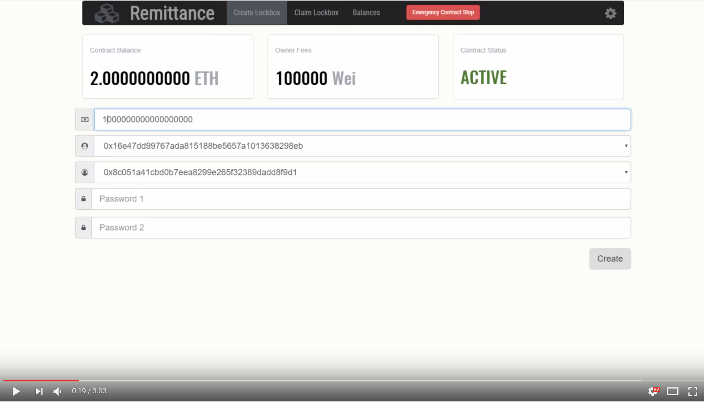

# Remittance ÐAPP 

Remittance ÐAPP is an Ethereum blockchain application that allows a contributor to store funds for a beneficiary within a "lockbox".  The beneficiary may then claim the funds using valid credentials so long as they are withdrawn before the lockblox claim deadline.  Two factor authentication protects the lockbox funds, but the contributor does not submit passwords in the clear to the underlying smart contract.  The contributor may also reclaim the funds once the deadline for a lockbox has elapsed.  Administrative features such as emergency stop, deadline configuration, owner fee configuration, and emergency fund recovery; are also supported by the smart contract.

